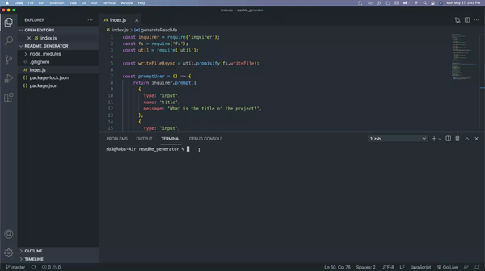

## ReadMe Generator

This project will help users create a high-quality README.  This application uses the inquirer package to prompt users through a series of questions to quickly populate a README.

## Installation

To use the README Generator first run npm install in the terminal to install the npm package.

## Usage Demo

## Contributor

Rob Brunett

## Questions

rob.brunett3@gmail.com

https://github.com/brunett82

